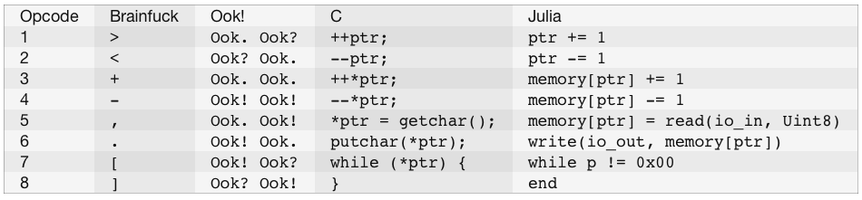

BISC.jl
=======

# The Brainfuck Instruction Set Computer

[Brainfuck](http://www.muppetlabs.com/~breadbox/bf/) and
[Ook!](http://www.dangermouse.net/esoteric/ook.html) are two esoteric languages
that share an identical set of underlying primitive operations, but employ
distinct surface syntax for writing programs. The BISC.jl package provides
tools for parsing, interpreting and translating both Brainfuck and Ook! using
this shared set of primitive operations.

The specific primitive operations that underlie the semantics of Brainfuck
and Ook! are enumerated below along with their equivalents in C and Julia:



Note that the instructions here are enumerated in a slightly unconventional
order for Brainfuck: in most listings of Brainfuck operations `.` precedes `,`
as an operation. We have chosen to use this ordering because it was employed
in the Ook! definition.

# Operations

BISC.jl provides three basic functions:

* `parse`: Parse a string of a language that can be converted to BISC ops.
* `interpret`: Interpret a vector of BISC ops.
* `translate`: Translate a vector of BISC ops into code in C, Brainfuck or Ook!.

These functions each allow a few keyword arguments to provide fine-grained
control over their behaviors.

* `parse`
    * Positional Arguments
        * `text::String`: An input program that will be parsed into BISC ops.
    * Keyword Arguments
        * `as::Symbol = :brainfuck`: Which language is the input written in?
            * `:brainfuck`
            * `:ook`
    * Return Values
        * `ops::Vector{BISCOp}`: The translated program as a list of BISC ops.

* `interpret`
    * Positional Arguments
        * `ops::Vector{BISCOp}`: A vector of BISC ops to be executed.
    * Keyword Arguments
        * `debug::Bool = false`: Should the state of the interpreter be shown?
        * `io_in::IO = STDIN`: Where should input for the interpreter come from?
        * `io_out::IO = STDOUT`: Where should output from the interpreter go?
    * Return Values
        * `nothing::Nothing`

* `translate`
    * Positional Arguments
        * `ops::Vector{BISCOp}`: A vector of BISC ops to be translated.
    * Keyword Arguments
        * `as::Symbol = :brainfuck`: The language to be translated into.
            * `:brainfuck`
            * `:c`
            * `:julia`
            * `:ook`
    * Return Values
        * `code::String`: An equivalent program in the requested language.

# Usage Examples

Here's a basic example of using the BISC package:

```
require("BISC.jl")

import BISC: parse, interpret, translate

text = ">--<"
ops = parse(text, as = :brainfuck)
interpret(ops)
translate(ops, as = :ook)

text = "Ook. Ook? Ook! Ook! Ook! Ook! Ook? Ook."
ops = parse(text, as = :ook)
interpret(ops)
translate(ops, as = :brainfuck)
```

And here's an example of translating Brainfuck to C code, compiling the C
code to machine code, and executing the machine code:

```
text = readall(
    Pkg.dir(
        "BISC",
        "test",
        "programs",
        "brainfuck",
        "gameoflife.bfk"
    )
)

ops = parse(text, as = :brainfuck)

code = translate(ops, as = :c)

sourcefile = string(tempname(), ".c")

io = open(sourcefile, "w")
print(io, code)
close(io)

exefile = tempname()
run(`clang -o $exefile $sourcefile`)
run(`$exefile`)
```

# License

All of the code I've written is licensed under the MIT license. The programs
used as test files were gathered from the Brainfuck and Ook! sites and did
not have any license information. If you own the copyright to one of those
files and would like me to take it down, please let me know.